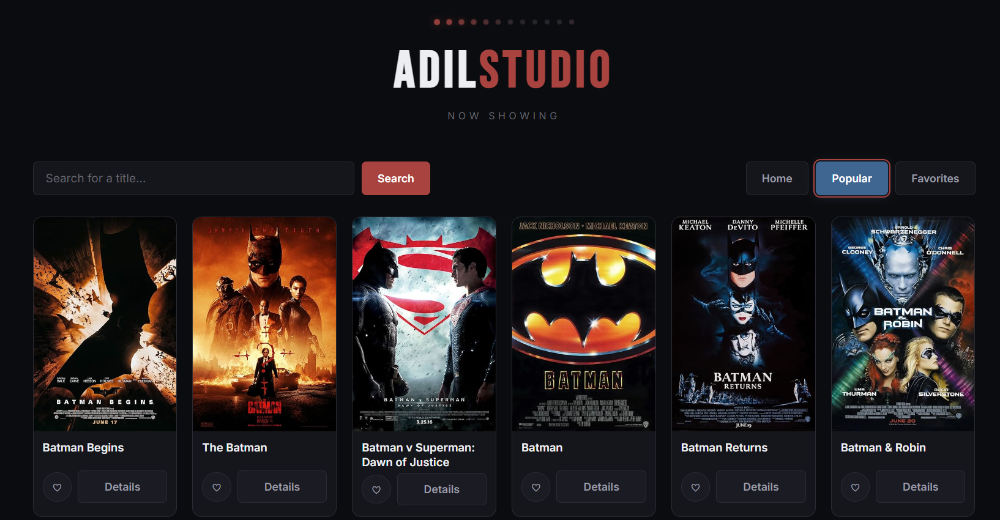

#  Movie App

A modern movie discovery application built with React that offers user friendly interface and allow users to browse, search and explore movies using a real time movie database API.

## Live Demo

🔗 https://adilmovieapp.netlify.app/

---

## 📸 Preview



---

##  Features

-  Search movies instantly
-  Browse trending and popular movies
-  View movie details
-  Display ratings and release dates
-  Fully responsive design
-  Fast API-powered search
-  Modern and clean UI

---

##  Built With

- React
- JavaScript (ES6+)
- Vite
- CSS3
- OMDB API 
- Fetch API

---

##  Project Structure

```
movie-app/
├── assets/
├── public/
├── src/
│   ├── components/
│   ├── App.jsx
│   ├── main.jsx
│   └── index.css
├── package.json
└── README.md
```

---


## 📄 License

This project is open source and available under the MIT License.
